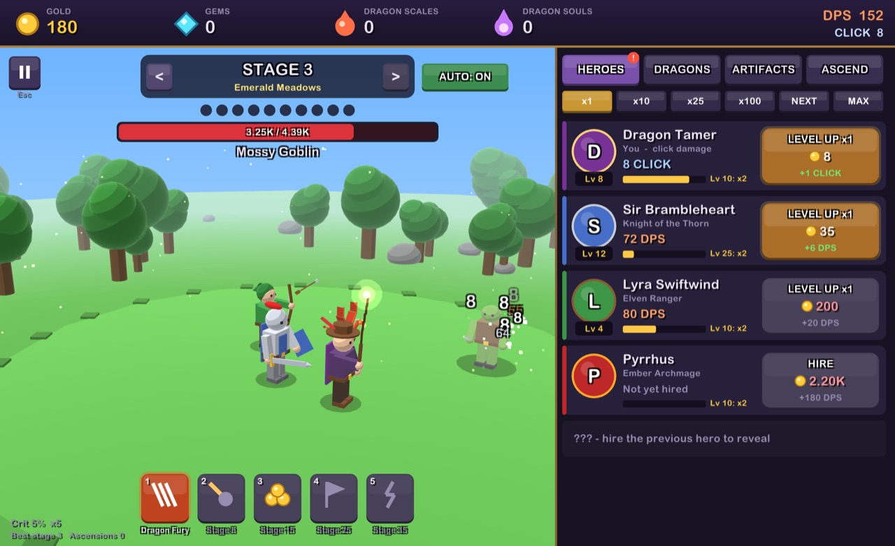
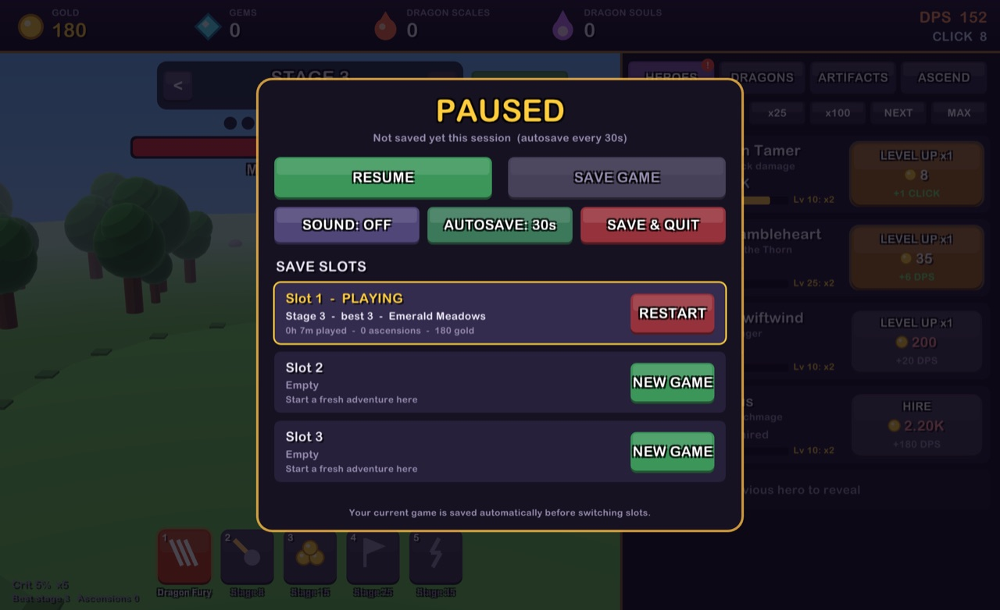

# Dragon Idle

Dragon Idle is a 3D fantasy idle clicker where you tame dragons, hire a party of heroes and fight your way through an endless series of stages. The numbers never stop going up, and neither do the explosions.



You click to attack while your heroes fight on their own. Every level-up gives you a little burst of feedback, and hero milestones give you a big one. Numbers aren't capped, so there's always a next stage, a next milestone and a next ascension.

## Features

- **Active and passive play.** Click the battlefield for critical hits and use five abilities, or leave your heroes to fight on their own.
- **Twelve 3D heroes to recruit.** Each has its own look and attack. Who joins next stays hidden until you hire the hero before them.
- **Heroes that visibly grow.** Heroes get slightly bigger as they level, their weapons start to glow, and aura rings appear under their feet at levels 25, 100, 500 and 1000.
- **Pet dragons.** Hatch six dragons that circle the battlefield, breathe fire at enemies and give you big multipliers.
- **Dragon bosses.** Every 10th stage is a named dragon boss, such as *Glaurung the Crimson Tyrant*, with a timer to beat.
- **Four currencies.** Gold, Gems, Dragon Scales and Dragon Souls, each with its own shop.
- **Uncapped numbers.** A custom number type goes past `double`, with suffixes from K, M, B up to Vg, then aa, ab and beyond.
- **Seven realms that cycle forever.** Emerald Meadows, Whispering Woods, Scorched Badlands, Frostfang Peaks, Crystal Caverns, Abyssal Void and Celestial Spire, each with its own monsters, scenery and ambient particles.
- **Lots of feedback.** Damage numbers, coins flying into your wallet, counters that roll up, screen shake, flashes, milestone banners and pillars of light.
- **Three save slots**, autosave with an adjustable interval, and gold earned while you're away.
- **No asset files for art or sound.** Everything is drawn from raylib primitives with a toon-lighting shader, and every sound effect is synthesised at startup.

## Getting the game

### Download

Pushing a `v*` tag builds every platform and publishes them on the repository's **Releases** page. All builds are self-contained, so you don't need .NET installed.

| Download | How to run it |
|---|---|
| `dragon-idle-<version>-macos-universal.zip` | Unzip and open **Dragon Idle.app**. It isn't notarized, so the first time, right-click it and choose **Open**, or run `xattr -dr com.apple.quarantine "Dragon Idle.app"`. |
| `dragon-idle-<version>-linux-x64.tar.gz` | Extract it and run `./dragon-idle/DragonIdle`. |
| `dragon-idle-<version>-win-x64.zip` | Extract it and run `dragon-idle\DragonIdle.exe`. It isn't code-signed, so SmartScreen may warn you: choose **More info**, then **Run anyway**. |

### Supported platforms

| Platform | Status |
|---|---|
| macOS, Apple Silicon | Supported and tested. Can be packaged as a `.app`. |
| macOS, Intel | Builds as part of the universal `.app`, not yet tested on Intel hardware. |
| Linux x64 | Packaged as a self-contained tarball, but untested. |
| Windows x64 | Packaged as a self-contained zip, but untested. |

The packaged app targets macOS 12 or later. On macOS the game uses Arial Rounded Bold from the system fonts. On other platforms it looks for Trebuchet (Windows) or DejaVu Sans (Linux) and falls back to raylib's built-in pixel font.

### Run from source

You need the [.NET 10 SDK](https://dotnet.microsoft.com/download/dotnet/10.0). [just](https://github.com/casey/just) is optional but handy.

From the project folder:

```sh
dotnet run          # or: just run
```

The window sizes itself to fit your display, and you can resize it.

### Install as a macOS app

```sh
just install-macos    # builds "Dragon Idle.app" and moves it into ~/Applications
just uninstall-macos  # moves it to the Trash again (your saves are kept)
```

`just build-macos` builds the app into `dist/` without installing it, and `just build-macos-universal` builds one that runs on both Apple Silicon and Intel Macs. The bundle is self-contained, so the Mac running it doesn't need .NET installed.

## How to play

Beat **10 monsters** to clear a stage. Every **5th stage** is a boss and every **10th stage** is a dragon boss, and you have **30 seconds** to beat either kind. If the timer runs out you drop back a stage to farm. Level up, then press **FIGHT BOSS!** to try again.

### Controls

| Action | Input |
|---|---|
| Attack | Left-click the battlefield, or `Space` |
| Abilities | `1` to `5`, or click the ability bar |
| Buy / level up | Click a shop button. Hold it down to keep buying. |
| Switch shop tab | Click the tabs, or `Tab` |
| Change stage | `<` and `>` in the stage header |
| Pause menu | `Esc`, `P`, or the pause button at the top left |
| Save now | `F5` |
| Mute | `M` |

The buy modes above the hero list are **x1**, **x10**, **x25**, **x100**, **NEXT** (buys exactly up to the next milestone) and **MAX** (buys as many as you can afford).

### Currencies

Your four currencies sit along the top bar. Each icon below matches the one in the game.

####  Gold

**What it is:** your everyday money, and the one you'll collect the most.

**How to collect it:** every monster drops gold when it dies, and you'll see the coins fly into your top bar. Tougher monsters drop more, so a boss is worth about ten normal monsters, and later stages pay much more than early ones. Your heroes also earn gold while the game is closed. When you come back, you get half of what they'd have earned farming your current stage, for up to 12 hours.

**What it does:** levels up your heroes and your own click damage (the **Dragon Tamer**), and hires new heroes. Gold is reset when you ascend.

####  Gems

**What it is:** a rare crystal, and the currency for permanent upgrades.

**How to collect it:** every boss drops gems (every 5th stage, including dragon bosses), and bosses on later stages drop more. Normal monsters also have a 1% chance to drop one.

**What it does:** buys **artifacts** in the Artifacts tab, which boost damage, gold, crits, boss timers and more. Gems and artifacts are never reset.

####  Dragon Scales

**What it is:** scales from the dragons you slay.

**How to collect it:** only **dragon bosses** drop them, on every 10th stage. Higher stages give more scales, and your first dragon boss gives enough for your first hatch.

**What it does:** hatches and feeds **pet dragons** in the Dragons tab. Each dragon flies into battle, breathes fire at enemies and gives a big bonus, such as more damage, more gold or stronger crits. Scales and dragons are never reset.

####  Dragon Souls

**What it is:** the currency you earn by starting over, and the one that powers long-term progress.

**How to collect it:** **ascend** from the Ascend tab once you've reached stage 30. You reset your stage, gold and heroes and get souls in return. The further you got, the more souls you get, and the amount grows exponentially with your highest stage.

**What it does:** two things.

- **Permanent damage.** Every soul you've *ever* earned gives +10% damage, even after you spend it.
- **The soul shop.** Spend souls on upgrades like more damage, more gold, auto-clicks and shorter cooldowns.

Souls and soul upgrades are never reset.

### Milestones

Hero damage grows with level, and also gets multiplied at milestones. There's no last milestone.

| Levels | Multiplier |
|---|---|
| 10, 25, 50, 75, 100 | x2 each |
| Every 25 levels from 125 to 975 | x3 each |
| Every 100 levels from 1000 | x5 each |

Your own click damage (the **Dragon Tamer**) uses the same milestones. Each Tamer milestone also makes every click add 0.5% of your total DPS.

### Abilities

| Key | Ability | Effect | Lasts | Cooldown | Unlocks at |
|---|---|---|---|---|---|
| `1` | Dragon Fury | Clicks deal x10 damage | 15s | 90s | Stage 3 |
| `2` | Meteor Storm | Rains down 60 seconds' worth of DPS | 3s | 120s | Stage 8 |
| `3` | Golden Hoard | x3 gold from all sources | 30s | 180s | Stage 15 |
| `4` | War Cry | x3 all damage | 30s | 240s | Stage 25 |
| `5` | Frenzy | 20 auto-clicks per second | 10s | 150s | Stage 35 |

### Ascension

Once you reach stage 30, the **ASCEND** tab lets you reset your stage, gold and heroes in exchange for Dragon Souls. The further you got, the more souls you get, and the amount grows exponentially. Gems, artifacts, dragons, souls and soul upgrades are all kept. Each ascension usually gets you further than the last.

<details>
<summary><strong>Pet dragons (Dragon Scales)</strong></summary>

| Dragon | Effect per level |
|---|---|
| Ember Wyrmling | +25% all damage, and x2 every 10 levels |
| Frost Drake | +50% click damage, and clicks deal +1% of your DPS |
| Gilded Wyvern | +30% gold |
| Storm Serpent | +0.5 critical damage multiplier (base x5) |
| Void Leviathan | +15% souls on ascension |
| Elder Sunwyrm | x1.12 all damage, compounding |

</details>

<details>
<summary><strong>Artifacts (Gems)</strong></summary>

| Artifact | Effect per level | Max level |
|---|---|---|
| Emberheart Amulet | +50% hero DPS | none |
| Titan's Gauntlet | +100% click damage | none |
| Crown of Avarice | +40% gold | none |
| Chrono Hourglass | +2s boss timer | 15 |
| Four-Leaf Talisman | +0.5% gem drop chance | 20 |
| Eye of the Storm | +1% critical chance | 30 |
| Monocle of Thrift | Hero costs x0.96 | 20 |
| Dragonbone Horn | +25% Dragon Scales | none |

</details>

<details>
<summary><strong>Soul shop (Dragon Souls)</strong></summary>

| Upgrade | Effect per level | Max level |
|---|---|---|
| Soul Might | x1.5 all damage | none |
| Midas Soul | x1.4 gold | none |
| Phantom Hands | +2 auto-clicks per second | 15 |
| Time Warp | -6% ability cooldowns | 10 |
| Savage Strikes | +2% critical chance | 15 |
| Soul Harvest | +15% souls on ascension | none |
| Dragon Bond | +20% to every pet dragon's effect | none |

</details>

### Saves



- **Three save slots.** Load, start a new game, restart or delete slots from the pause menu. The game reopens the slot you played last.
- **Autosave** runs every 30 seconds by default. Click **AUTOSAVE** in the pause menu to cycle through Off, 15s, 30s, 1m and 2m. When autosave is on, the game also saves when you pause, switch slots or close the window. When it's off, it only saves when you press **Save Game**, `F5` or **Save & Quit**.
- **Offline progress.** When you come back, you get the gold your heroes would have earned farming your current stage, at half speed, for up to 12 hours.
- Saves live in `~/Library/Application Support/DragonIdle/` on macOS, `%LOCALAPPDATA%\DragonIdle\` on Windows and `~/.local/share/DragonIdle/` on Linux. Your autosave and sound settings are stored there too, in `settings.json`.

## Contributing

Contributions are welcome, especially new heroes, enemies, realms, balance tuning, and testing on Windows, Linux and Intel Macs.

### Development setup

- .NET 10 SDK
- [just](https://github.com/casey/just) (optional)
- macOS for building the `.app` (uses `sips`, `iconutil`, `lipo` and `codesign`) and for `just shots` (uses `sips`)

| Recipe | What it does |
|---|---|
| `just run` | Run the game |
| `just build` | Debug build |
| `just demo` | Run with a late-game save that never touches your real save slots |
| `just shots` | Play the screenshot tour and refresh `docs/screenshots/` and `docs/icons/` |
| `just icon` | Re-render the app icon (PNG and Windows `.ico`) from the in-game dragon |
| `just build-macos` / `just build-macos-universal` | Package `Dragon Idle.app` into `dist/` |
| `just build-linux` | Package a Linux x64 tarball into `dist/` |
| `just build-windows` | Package a Windows x64 zip into `dist/` |
| `just run-macos` | Package and launch the app |
| `just install-macos` / `just uninstall-macos` | Install to / remove from `~/Applications` |
| `just clean` | Delete build output |

### Project layout

| Path | Contents |
|---|---|
| `src/Program.cs` | Window setup, main loop, camera, the 3D viewport, pause and slot handling |
| `src/Game.cs` | Game state and rules: damage, kills, stages, bosses, shops, ascension, save/load, offline progress |
| `src/Defs.cs` | Heroes, realms, enemies, artifacts, dragons, soul upgrades, abilities and milestone rules (a good first place to contribute) |
| `src/BigNum.cs` | The uncapped number type and its number formatting |
| `src/Render.cs` | Toon-lighting shader, primitive helpers, and every hero, enemy, dragon and realm model |
| `src/Fx.cs` | Particles, projectiles, damage numbers, banners, flying coins, screen shake and flashes |
| `src/Ui.cs` | Top bar, stage header, ability bar, shop tabs and the pause menu |
| `src/Sfx.cs` | Synthesised sound effects |
| `src/Settings.cs` | Autosave and mute settings, shared by all save slots |
| `src/ShotTour.cs` | The scripted screenshot tour and the currency icon renderer |
| `src/IconRenderer.cs` | Renders the app icon from the in-game dragon model |
| `assets/icon/` | `AppIcon.png` (macOS `.icns`, Linux and the window icon) and `AppIcon.ico` (Windows `.exe`) |
| `scripts/package-mac.sh`, `scripts/package-linux.sh`, `scripts/package-windows.sh` | Packaging for each platform |
| `.github/workflows/release.yml` | Builds every platform and publishes a GitHub release when a `v*` tag is pushed |

### Handy dev tools

- **Screenshot tour:** `DRAGON_SHOTS=/some/dir dotnet run` plays a scripted tour of staged early-game scenes (gameplay and the pause menu) and saves a PNG of each. It also renders the four currency icons to transparent PNGs in an `icons/` subfolder. `just shots` runs the tour, converts the screenshots into the 1280px-wide JPEGs in `docs/screenshots/` and copies the icons into `docs/icons/`. That's how the images in this README were made. The tour never writes to your save slots.
- **App icon:** `dotnet run -- --render-icon assets/icon/AppIcon.png` renders the 1024px icon from the real dragon model, plus a multi-size `AppIcon.ico` next to it. Every package uses these: the macOS `.icns`, the icon embedded in the Windows `.exe` and the window icon on Windows and Linux.
- **Demo mode:** `dotnet run -- --demo` starts at stage 40 with most heroes and dragons unlocked. Nothing is saved, which makes it handy for checking visuals.

### Guidelines

- Work on a branch and keep `main` releasable.
- Use [Conventional Commits](https://www.conventionalcommits.org/) (`feat(heroes): ...`, `fix(saves): ...`, `chore(docs): ...`).
- Keep screenshots to the early game so later heroes, realms and dragons stay a surprise.
- Match the surrounding code style. Keep player-facing text dramatic and code clear.
- There's no automated test suite yet, so run `dotnet build` and play the part you changed (`just demo` and `just shots` make this quick). Include a screenshot in the PR for visual changes.
- Art and sound are generated in code. If you add asset files, they must be licensed for redistribution (CC0 preferred), with the license included next to them.

## Credits

- Built with [raylib](https://www.raylib.com) via [Raylib-cs](https://github.com/raylib-cs/raylib-cs).
- Inspired by *DPS Idle 2* and other incremental games.

## License

Released under the [MIT License](LICENSE).
